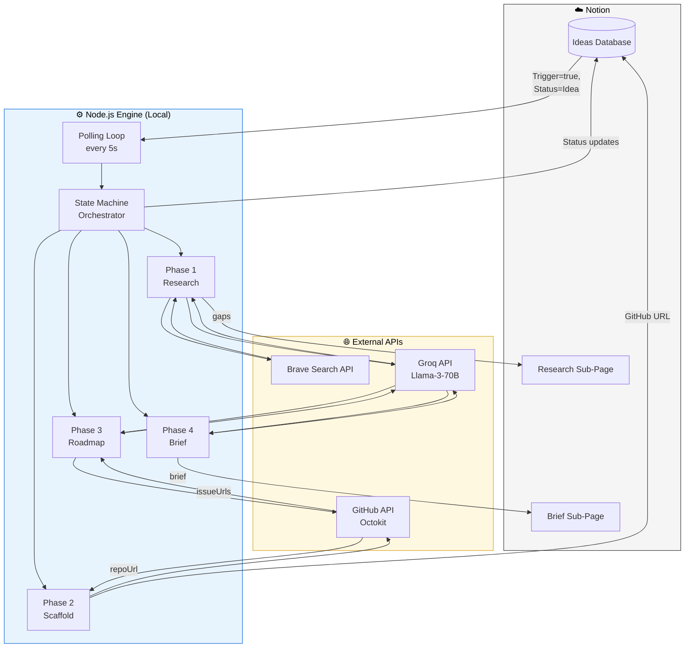
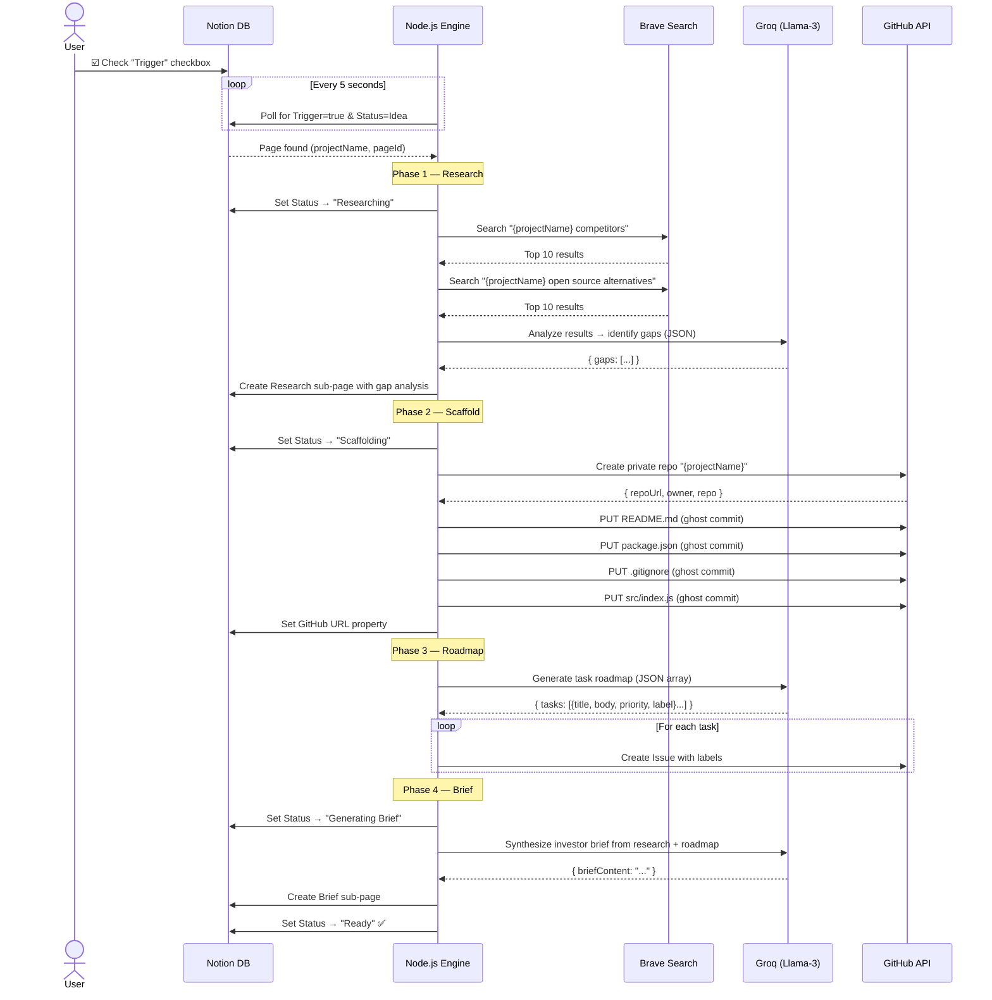
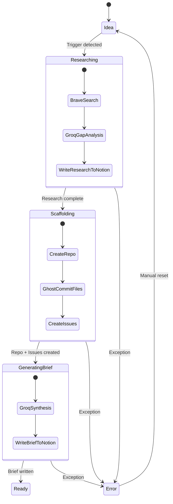
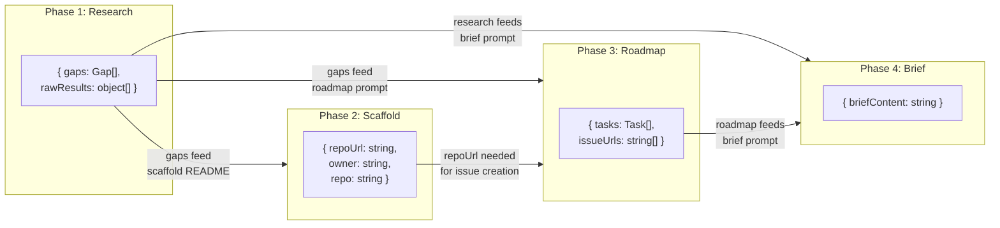
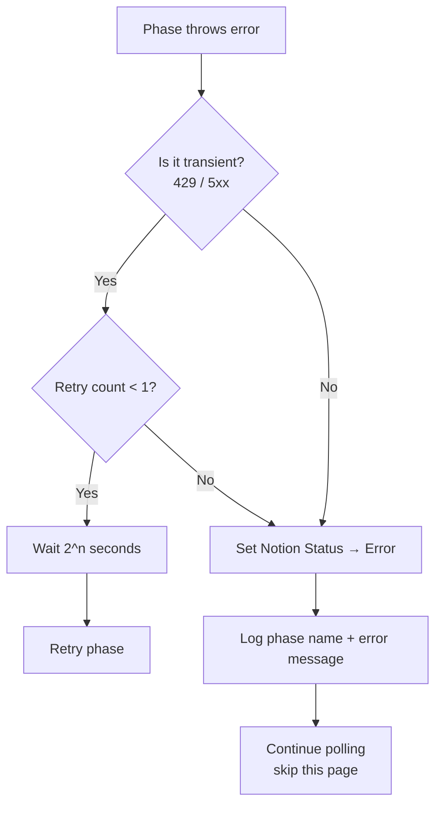

# Technical Design Document: ZeroToRepo MVP

> **48-Hour Hackathon Build** · Node.js · Notion → GitHub Pipeline · AI-Powered

---

## 1. Executive Summary

| Field | Value |
| :--- | :--- |
| **System** | ZeroToRepo — CLI-based Automation Engine |
| **Runtime** | Node.js v20+ (local execution) |
| **Primary Goal** | Turn a Notion idea into a fully scaffolded GitHub repo in **< 60 seconds** |
| **Trigger** | Single checkbox click in Notion |
| **Output** | Private GitHub repo + labeled issues + competitor research + investor brief |
| **Build Window** | 48 hours (hackathon) |
| **Total API Cost** | $0 (all free tiers) |

---

## 2. System Architecture

### 2.1 High-Level Architecture Diagram



### 2.2 End-to-End Sequence Diagram



### 2.3 State Machine



---

## 3. Tech Stack

| Layer | Technology | Rationale |
| :--- | :--- | :--- |
| **Runtime** | Node.js v20+ | Native async/await, excellent JSON handling, fast startup |
| **State/UI** | Notion API (`@notionhq/client`) | Already used for planning; acts as dashboard with zero extra UI work |
| **AI** | Groq + `llama-3-70b-8192` | Fastest LLM inference available (~500 tok/s); free tier = 30 RPM / 14.4K TPD |
| **Search** | Brave Search API | Developer-friendly JSON, 2K free queries/month, no SERP scraping needed |
| **Git** | Octokit (`@octokit/rest`) | Official GitHub SDK; Data API enables ghost commits (no `git clone`) |
| **CLI UX** | `@clack/prompts` | Beautiful terminal spinners/progress for live demo |
| **Config** | `dotenv` | Standard `.env` pattern for secrets |

---

## 4. Project Structure

```
zerotorepo/
├── src/
│   ├── index.js            # Entry point — polling loop + CLI output
│   ├── stateMachine.js     # State transitions & phase orchestration
│   ├── notion.js           # Notion API helpers (poll, update, write)
│   ├── research.js         # Brave Search + Groq gap analysis
│   ├── scaffold.js         # GitHub repo creation + ghost commits
│   ├── roadmap.js          # Groq roadmap generation + issue creation
│   ├── brief.js            # Investor brief synthesis
│   └── config.js           # Environment config validation
├── prompts/
│   ├── gap-analysis.txt    # System prompt for competitor gap analysis
│   ├── roadmap.txt         # System prompt for task roadmap generation
│   └── brief.txt           # System prompt for investor brief synthesis
├── .env.example            # Template with all required keys
├── .gitignore
├── package.json
└── README.md
```

---

## 5. Component Design

### 5.1 `config.js` — Environment Validation

Validates all required environment variables at startup. Fails fast with clear messages.

```js
// Required environment variables
const REQUIRED = [
  'NOTION_API_KEY',       // Notion integration secret (ntn_*)
  'NOTION_DATABASE_ID',   // 32-char hex ID of the Ideas database
  'GROQ_API_KEY',         // Groq API key (gsk_*)
  'BRAVE_API_KEY',        // Brave Search API key
  'GITHUB_TOKEN',         // GitHub PAT with repo scope
  'GITHUB_OWNER',         // GitHub username or org for new repos
];

// Exported config object
module.exports = {
  notion: { apiKey, databaseId },
  groq:   { apiKey, model: 'llama-3-70b-8192' },
  brave:  { apiKey },
  github: { token, owner },
  polling: { intervalMs: 5000 },
};
```

---

### 5.2 `notion.js` — Notion API Helpers

| Function | Signature | Description |
| :--- | :--- | :--- |
| `pollForTrigger` | `() → Promise<Page \| null>` | Queries DB for pages with `Trigger == true` AND `Status == Idea`; returns first match |
| `updateStatus` | `(pageId, status) → Promise<void>` | Sets the Status property to one of: `Researching`, `Scaffolding`, `Generating Brief`, `Ready`, `Error` |
| `writeSubPage` | `(parentId, title, markdownContent) → Promise<string>` | Creates a child page under the idea with rich-text blocks; returns new page ID |
| `setGitHubUrl` | `(pageId, url) → Promise<void>` | Sets the `GitHub URL` property on the idea row |
| `resetTrigger` | `(pageId) → Promise<void>` | Unchecks the `Trigger` checkbox to prevent re-processing |

**Notion Database Schema (exact property names):**

| Property Name | Type | Values / Format |
| :--- | :--- | :--- |
| `Name` | `title` | Project name string |
| `Status` | `status` | `Idea` · `Researching` · `Scaffolding` · `Generating Brief` · `Ready` · `Error` |
| `Trigger` | `checkbox` | `true` / `false` |
| `GitHub URL` | `url` | `https://github.com/{owner}/{repo}` |

**Key API call — polling query:**

```js
const response = await notion.databases.query({
  database_id: config.notion.databaseId,
  filter: {
    and: [
      { property: 'Trigger',  checkbox: { equals: true } },
      { property: 'Status', status: { equals: 'Idea' } },
    ],
  },
  page_size: 1,
});
```

---

### 5.3 `research.js` — Brave Search + Groq Gap Analysis

| Function | Signature | Description |
| :--- | :--- | :--- |
| `searchBrave` | `(query) → Promise<object[]>` | Calls Brave Web Search; returns top 10 results `[{title, url, description}]` |
| `analyzeGaps` | `(projectName, searchResults) → Promise<{gaps: string}>` | Sends results to Groq with gap-analysis prompt; returns structured gaps |
| `writeResearchToNotion` | `(pageId, gaps) → Promise<void>` | Creates a "Research — {name}" sub-page with formatted gap analysis |

**Brave API call:**

```
GET https://api.search.brave.com/res/v1/web/search?q={query}&count=10
Headers: { "X-Subscription-Token": BRAVE_API_KEY }
```

**Groq parameters (gap analysis):**

```json
{
  "model": "llama-3-70b-8192",
  "temperature": 0.3,
  "max_tokens": 2048,
  "response_format": { "type": "json_object" },
  "messages": [
    { "role": "system", "content": "<gap-analysis system prompt>" },
    { "role": "user", "content": "Project: {name}\n\nSearch Results:\n{formatted results}" }
  ]
}
```

**Expected Groq response shape:**

```json
{
  "gaps": [
    { "gap": "No real-time collaboration support", "opportunity": "Build with CRDTs for live editing" },
    { "gap": "Poor mobile experience", "opportunity": "PWA-first responsive architecture" },
    { "gap": "No plugin ecosystem", "opportunity": "Design an extension API from day one" }
  ],
  "summary": "The competitive landscape shows..."
}
```

---

### 5.4 `scaffold.js` — GitHub Repo + Ghost Commits

| Function | Signature | Description |
| :--- | :--- | :--- |
| `createRepo` | `(name) → Promise<{repoUrl, owner, repo}>` | Creates a private repo via `POST /user/repos` |
| `ghostCommit` | `(owner, repo, files) → Promise<void>` | Writes multiple files to `main` without cloning (GitHub Data API) |
| `createIssues` | `(owner, repo, tasks) → Promise<string[]>` | Creates labeled issues from roadmap tasks; returns issue URLs |

**Ghost Commit Technique:**

Instead of `git clone → write → commit → push`, we use the GitHub Git Data API:

```
1. GET  /repos/{owner}/{repo}/git/ref/heads/main          → get current SHA
2. GET  /repos/{owner}/{repo}/git/commits/{sha}            → get tree SHA
3. POST /repos/{owner}/{repo}/git/blobs                    → create blob for each file
4. POST /repos/{owner}/{repo}/git/trees                    → create tree with all blobs
5. POST /repos/{owner}/{repo}/git/commits                  → create commit pointing to new tree
6. PATCH /repos/{owner}/{repo}/git/refs/heads/main         → update main to new commit
```

This commits **all files atomically in one commit** — much faster than individual `PUT /repos/{owner}/{repo}/contents/{path}` calls.

**Default scaffold files:**

| File | Content Source |
| :--- | :--- |
| `README.md` | Template with project name, description from Notion, and gap summary |
| `package.json` | Generated with project name, version `0.1.0`, MIT license |
| `.gitignore` | Standard Node.js `.gitignore` |
| `src/index.js` | Placeholder: `// TODO: Start building {projectName}` |

**GitHub API endpoints used:**

| Endpoint | Method | Purpose |
| :--- | :--- | :--- |
| `/user/repos` | `POST` | Create private repository |
| `/repos/{owner}/{repo}/git/ref/heads/main` | `GET` | Get latest commit SHA |
| `/repos/{owner}/{repo}/git/commits/{sha}` | `GET` | Get tree SHA |
| `/repos/{owner}/{repo}/git/blobs` | `POST` | Create file blobs |
| `/repos/{owner}/{repo}/git/trees` | `POST` | Create tree with blobs |
| `/repos/{owner}/{repo}/git/commits` | `POST` | Create commit object |
| `/repos/{owner}/{repo}/git/refs/heads/main` | `PATCH` | Fast-forward main |
| `/repos/{owner}/{repo}/issues` | `POST` | Create issues |
| `/repos/{owner}/{repo}/labels` | `POST` | Create custom labels |

---

### 5.5 `roadmap.js` — Groq Roadmap + Issue Mapping

| Function | Signature | Description |
| :--- | :--- | :--- |
| `generateRoadmap` | `(projectName, gaps) → Promise<{tasks: Task[]}>` | Prompts Groq for a JSON array of 7–10 prioritized tasks |
| `parseAndValidateJSON` | `(response) → object` | Safely parses Groq output; throws if schema doesn't match |

**Groq parameters (roadmap):**

```json
{
  "model": "llama-3-70b-8192",
  "temperature": 0.4,
  "max_tokens": 3000,
  "response_format": { "type": "json_object" },
  "messages": [
    { "role": "system", "content": "<roadmap system prompt>" },
    { "role": "user", "content": "Project: {name}\nGaps: {gaps}\nGenerate 7-10 tasks." }
  ]
}
```

**Expected task schema:**

```json
{
  "tasks": [
    {
      "title": "Set up project boilerplate with Express",
      "description": "Initialize Node.js project with Express, configure ESLint, add health-check endpoint at /api/health.",
      "priority": "high",
      "label": "setup"
    }
  ]
}
```

**Label mapping for GitHub Issues:**

| Priority | GitHub Label | Color |
| :--- | :--- | :--- |
| `high` | `priority: high` | `#d73a4a` (red) |
| `medium` | `priority: medium` | `#fbca04` (yellow) |
| `low` | `priority: low` | `#0e8a16` (green) |

Additional labels applied from the `label` field: `setup`, `feature`, `research`, `infra`, `docs`.

---

### 5.6 `brief.js` — Investor Brief Synthesis

| Function | Signature | Description |
| :--- | :--- | :--- |
| `synthesizeBrief` | `(projectName, research, roadmap) → Promise<{briefContent: string}>` | Combines research + roadmap into a compelling 1-page brief |
| `writeBriefToNotion` | `(pageId, briefContent) → Promise<void>` | Creates a "Brief — {name}" sub-page under the idea |

**Groq parameters (brief):**

```json
{
  "model": "llama-3-70b-8192",
  "temperature": 0.6,
  "max_tokens": 4000,
  "messages": [
    { "role": "system", "content": "<brief system prompt>" },
    { "role": "user", "content": "Project: {name}\nResearch: {gaps}\nRoadmap: {tasks}\nWrite a 1-page investor brief." }
  ]
}
```

**Brief structure (output sections):**

1. **Problem** — What pain point does this solve?
2. **Market Gap** — What do competitors miss? (from research)
3. **Solution** — What will this project build?
4. **Roadmap** — Key milestones (from roadmap tasks)
5. **Why Now** — Market timing argument

---

### 5.7 `stateMachine.js` — Orchestrator

The central orchestrator that drives an idea through all four phases in sequence.

```js
async function processIdea(page) {
  const pageId = page.id;
  const projectName = extractTitle(page);

  // Phase 1: Research
  await notion.updateStatus(pageId, 'Researching');
  const research = await runPhase('Research', async () => {
    const results1 = await searchBrave(`${projectName} competitors`);
    const results2 = await searchBrave(`${projectName} open source alternatives`);
    const gaps = await analyzeGaps(projectName, [...results1, ...results2]);
    await writeResearchToNotion(pageId, gaps);
    return gaps;
  });

  // Phase 2: Scaffold
  await notion.updateStatus(pageId, 'Scaffolding');
  const repo = await runPhase('Scaffold', async () => {
    const { repoUrl, owner, repo } = await createRepo(projectName);
    await ghostCommit(owner, repo, generateScaffoldFiles(projectName, research));
    await notion.setGitHubUrl(pageId, repoUrl);
    return { repoUrl, owner, repo };
  });

  // Phase 3: Roadmap → Issues
  const roadmap = await runPhase('Roadmap', async () => {
    const { tasks } = await generateRoadmap(projectName, research);
    const issueUrls = await createIssues(repo.owner, repo.repo, tasks);
    return { tasks, issueUrls };
  });

  // Phase 4: Brief
  await notion.updateStatus(pageId, 'Generating Brief');
  await runPhase('Brief', async () => {
    const { briefContent } = await synthesizeBrief(projectName, research, roadmap);
    await writeBriefToNotion(pageId, briefContent);
    return { briefContent };
  });

  // Done
  await notion.updateStatus(pageId, 'Ready');
  await notion.resetTrigger(pageId);
}
```

---

## 6. Data Flow Between Phases



### Phase Output Contracts

| Phase | Output Type | Shape |
| :--- | :--- | :--- |
| **Phase 1** (Research) | `ResearchResult` | `{ gaps: Array<{gap: string, opportunity: string}>, summary: string, rawResults: object[] }` |
| **Phase 2** (Scaffold) | `ScaffoldResult` | `{ repoUrl: string, owner: string, repo: string }` |
| **Phase 3** (Roadmap) | `RoadmapResult` | `{ tasks: Array<{title: string, description: string, priority: "high"\|"medium"\|"low", label: string}>, issueUrls: string[] }` |
| **Phase 4** (Brief) | `BriefResult` | `{ briefContent: string }` |

---

## 7. Error Handling Strategy

### 7.1 Per-Phase Try/Catch

Every phase is wrapped in a `runPhase` helper:

```js
async function runPhase(phaseName, fn) {
  const MAX_RETRIES = 1;
  for (let attempt = 0; attempt <= MAX_RETRIES; attempt++) {
    try {
      return await fn();
    } catch (err) {
      const isTransient = err.status === 429 || (err.status >= 500 && err.status < 600);
      if (isTransient && attempt < MAX_RETRIES) {
        const delay = Math.pow(2, attempt + 1) * 1000; // 2s, 4s...
        console.warn(`[${phaseName}] Transient error (${err.status}), retrying in ${delay}ms...`);
        await sleep(delay);
        continue;
      }
      throw new PhaseError(phaseName, err);
    }
  }
}
```

### 7.2 Error Recovery



### 7.3 Idempotency Checks

Each phase checks for prior completion before executing:

| Phase | Idempotency Check |
| :--- | :--- |
| **Research** | Skip if a sub-page titled "Research — {name}" already exists |
| **Scaffold** | Skip if `GitHub URL` property is already populated |
| **Roadmap** | Skip if repo already has ≥ 5 open issues |
| **Brief** | Skip if a sub-page titled "Brief — {name}" already exists |

This allows safe re-runs if the process crashes mid-pipeline.

---

## 8. Implementation Timeline (48-Hour Hackathon)

### Hour 0–6: Foundation

| Task | Hours | Deliverable |
| :--- | :--- | :--- |
| Project init (`npm init`, install deps) | 0–1 | `package.json` with all dependencies |
| Write `config.js` with env validation | 1–2 | Fail-fast startup with clear error messages |
| Write `notion.js` — poll + status update | 2–4 | Polling loop detects trigger within 5 seconds |
| Wire up `index.js` with `@clack/prompts` | 4–6 | CLI shows live status: `◼ Polling… ◼ Found: ProjectX` |

### Hour 6–18: Core Pipeline

| Task | Hours | Deliverable |
| :--- | :--- | :--- |
| Write `research.js` — Brave + Groq | 6–9 | Gap analysis written as Notion sub-page |
| Write `scaffold.js` — repo + ghost commit | 9–13 | Private repo appears on GitHub with scaffold files |
| Write `roadmap.js` — Groq JSON → issues | 13–16 | 7–10 labeled issues created on GitHub |
| Write `brief.js` — investor brief | 16–18 | Brief sub-page created in Notion |

### Hour 18–30: Integration & State Machine

| Task | Hours | Deliverable |
| :--- | :--- | :--- |
| Write `stateMachine.js` — full orchestration | 18–22 | End-to-end flow: Idea → Ready |
| Error handling + retry logic | 22–26 | Graceful failures with Notion "Error" status |
| Idempotency checks | 26–28 | Safe re-runs after crash |
| Mock mode (`--mock` flag) | 28–30 | Full demo without burning API quota |

### Hour 30–42: Polish & Testing

| Task | Hours | Deliverable |
| :--- | :--- | :--- |
| End-to-end smoke testing | 30–34 | 3 different ideas processed successfully |
| CLI UX polish (spinners, colors, timing) | 34–38 | Demo-ready terminal output |
| Prompt engineering refinement | 38–40 | Higher quality research/roadmap/brief output |
| Edge cases (long names, special chars) | 40–42 | Robust input handling |

### Hour 42–48: Demo Prep

| Task | Hours | Deliverable |
| :--- | :--- | :--- |
| Write `README.md` with setup instructions | 42–44 | Judges can clone and run in < 2 minutes |
| Record backup demo video | 44–46 | Insurance against live demo failures |
| Rehearse live demo flow | 46–48 | Smooth 3-minute presentation |

---

## 9. MCP-Accelerated Development Workflow

ZeroToRepo is built **with AI assistance at every step**. MCP (Model Context Protocol) servers give the AI assistant direct access to each API, eliminating guesswork.

### 9.1 Notion MCP

| Step | MCP Prompt | What You Learn |
| :--- | :--- | :--- |
| 1 | *"Read my Notion database schema for {DATABASE_ID}"* | Exact property names, IDs, and types — no manual inspection |
| 2 | *"Query pages where Trigger is checked"* | Validate filter syntax before writing code |
| 3 | *"Update the status of page {ID} to Researching"* | Confirm write permissions and status option names |
| 4 | *"Create a child page under {ID} with this markdown"* | Test sub-page creation and block formatting |

### 9.2 GitHub MCP

| Step | MCP Prompt | What You Learn |
| :--- | :--- | :--- |
| 1 | *"Create a test repo called ztr-test-001"* | Validate PAT has `repo` scope |
| 2 | *"List files in the main branch of ztr-test-001"* | Confirm ghost commit worked |
| 3 | *"Create an issue with labels on ztr-test-001"* | Test label creation + issue body formatting |

### 9.3 Brave Search MCP

| Step | MCP Prompt | What You Learn |
| :--- | :--- | :--- |
| 1 | *"Search for 'notion automation tool competitors'"* | See result shape and quality |
| 2 | *"Search for 'open source project scaffolding'"* | Refine query patterns for best results |

### 9.4 Why This Matters

```
Traditional workflow:
  Read docs → Write code → Run → Hit error → Read docs again → Fix → Repeat
  ⏱️ ~20 minutes per API integration

MCP workflow:
  Ask assistant → Get working code with real data → Validate → Ship
  ⏱️ ~5 minutes per API integration

Savings across 4 APIs: ~60 minutes → enables more polish time
```

---

## 10. API Contract Details

### 10.1 Groq API

| Parameter | Gap Analysis | Roadmap | Brief |
| :--- | :--- | :--- | :--- |
| **Model** | `llama-3-70b-8192` | `llama-3-70b-8192` | `llama-3-70b-8192` |
| **Temperature** | `0.3` (factual) | `0.4` (structured) | `0.6` (creative) |
| **Max Tokens** | `2048` | `3000` | `4000` |
| **Response Format** | `{ type: "json_object" }` | `{ type: "json_object" }` | `null` (free-text markdown) |
| **Endpoint** | `POST https://api.groq.com/openai/v1/chat/completions` | same | same |

**Rate limits (free tier):** 30 requests/min, 14,400 tokens/day, 6,000 tokens/min.

### 10.2 Brave Search API

| Parameter | Value |
| :--- | :--- |
| **Endpoint** | `GET https://api.search.brave.com/res/v1/web/search` |
| **Auth Header** | `X-Subscription-Token: {BRAVE_API_KEY}` |
| **Query Params** | `q={query}&count=10&safesearch=moderate` |
| **Rate Limit** | 1 request/second, 2,000 queries/month (free) |

### 10.3 Notion API

| Parameter | Value |
| :--- | :--- |
| **Base URL** | `https://api.notion.com/v1` |
| **Auth Header** | `Authorization: Bearer {NOTION_API_KEY}` |
| **Version Header** | `Notion-Version: 2022-06-28` |
| **Rate Limit** | 3 requests/second (average) |

### 10.4 GitHub API (Octokit)

| Parameter | Value |
| :--- | :--- |
| **Base URL** | `https://api.github.com` |
| **Auth** | `token` auth via Octokit constructor |
| **Required Scopes** | `repo` (full control of private repos) |
| **Rate Limit** | 5,000 requests/hour (authenticated) |

---

## 11. Testing Strategy

### 11.1 Manual Smoke Test Checklist

Run these tests before the demo to verify end-to-end functionality:

| # | Test | Expected Result | ✅ |
| :--- | :--- | :--- | :--- |
| 1 | Start script with valid `.env` | CLI shows "Polling…" with spinner | ☐ |
| 2 | Start script with missing env var | Fails immediately with clear message | ☐ |
| 3 | Check "Trigger" on a new idea | Status cycles: Researching → Scaffolding → Generating Brief → Ready | ☐ |
| 4 | Check GitHub after run | Repo exists with README, package.json, .gitignore, src/index.js | ☐ |
| 5 | Check GitHub Issues | 7–10 issues with `priority: high/medium/low` labels | ☐ |
| 6 | Check Notion sub-pages | "Research" and "Brief" sub-pages exist with real content | ☐ |
| 7 | Check Notion row | `GitHub URL` is populated, `Status` = Ready, `Trigger` unchecked | ☐ |
| 8 | Re-trigger same idea | Idempotency: skips already-completed phases | ☐ |
| 9 | Simulate API error | Status set to "Error", error logged, other ideas unaffected | ☐ |
| 10 | Run 3 different ideas sequentially | All 3 succeed with unique repos and content | ☐ |

### 11.2 Mock Mode (`--mock` flag)

For demos without Wi-Fi or to preserve API quota:

```bash
node src/index.js --mock
```

**Behavior:**
- Skips all external API calls (Brave, Groq, GitHub, Notion)
- Uses hardcoded realistic responses from `fixtures/` folder
- Simulates timing delays (2s per phase) for demo realism
- Prints the same CLI output as production mode
- Useful for rehearsal and offline judging sessions

### 11.3 Notion DB Reset Script

```bash
node scripts/reset-db.js
```

**Behavior:**
- Queries all pages in the database
- Sets `Status` → `Idea`, `Trigger` → `false`, `GitHub URL` → empty
- Deletes all sub-pages (Research, Brief)
- Used between demo runs to return to a clean state

---

## 12. Cost Breakdown

| Service | Tier | Limit | Cost | Notes |
| :--- | :--- | :--- | :--- | :--- |
| **Groq API** | Free | 14.4K tokens/day, 30 RPM | **$0** | ~3 full runs per day within token budget |
| **Brave Search** | Free | 2,000 queries/month | **$0** | 2 queries per run = 1,000 runs/month |
| **Notion API** | Free (integration) | 3 req/s avg | **$0** | ~10 calls per run; well within limits |
| **GitHub API** | Free (PAT) | 5,000 req/hour | **$0** | ~15 calls per run; unlimited runs |
| **Node.js** | — | — | **$0** | Local execution |
| | | | **Total: $0** | |

---

## 13. Security & Secrets

| Secret | Storage | Scope |
| :--- | :--- | :--- |
| `NOTION_API_KEY` | `.env` (gitignored) | Single integration, single database |
| `GROQ_API_KEY` | `.env` (gitignored) | Personal free-tier key |
| `BRAVE_API_KEY` | `.env` (gitignored) | Personal free-tier key |
| `GITHUB_TOKEN` | `.env` (gitignored) | PAT scoped to `repo` only |

**`.env.example`** ships with placeholder values so new contributors know what to configure:

```env
NOTION_API_KEY=ntn_your_integration_secret_here
NOTION_DATABASE_ID=your_32_char_hex_database_id_here
GROQ_API_KEY=gsk_your_groq_api_key_here
BRAVE_API_KEY=your_brave_search_api_key_here
GITHUB_TOKEN=ghp_your_github_pat_here
GITHUB_OWNER=your_github_username
```

---

## 14. Success Criteria

| Metric | Target | How to Measure |
| :--- | :--- | :--- |
| **Time to Repo** | < 60 seconds | Stopwatch from checkbox click to GitHub URL appearing in Notion |
| **Roadmap Depth** | ≥ 7 issues | Count of issues created in the new repo |
| **Research Quality** | ≥ 3 specific gaps | Manual review — gaps must reference real competitors |
| **Brief Quality** | Project-specific insights | Manual review — no generic LLM filler |
| **Zero Config** | 0 manual git commands | User only clicks a checkbox |
| **Error Recovery** | Graceful | Errors show in Notion, don't crash the process |
| **Demo Reliability** | 3/3 successful runs | Three consecutive ideas processed without failure |

---

## 15. Dependencies (`package.json`)

```json
{
  "name": "zerotorepo",
  "version": "0.1.0",
  "description": "Turn Notion ideas into GitHub repos in under 60 seconds",
  "main": "src/index.js",
  "scripts": {
    "start": "node src/index.js",
    "mock": "node src/index.js --mock",
    "reset": "node scripts/reset-db.js"
  },
  "dependencies": {
    "@notionhq/client": "^2.2.0",
    "@octokit/rest": "^20.0.0",
    "groq-sdk": "^0.5.0",
    "dotenv": "^16.4.0",
    "@clack/prompts": "^0.7.0"
  }
}
```

---

*Document Owner: Hackathon Team · Built for the 48-Hour Sprint · Last Updated: 2026-03-24*
