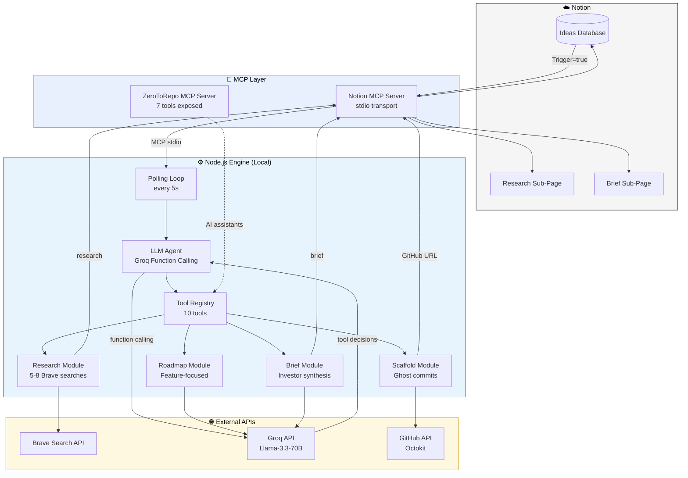
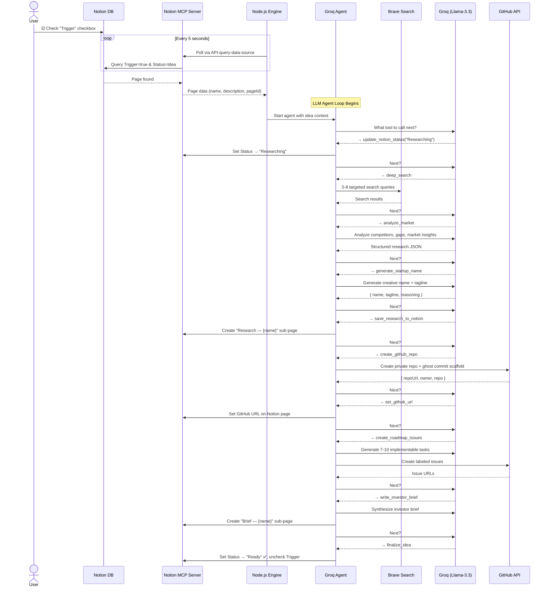
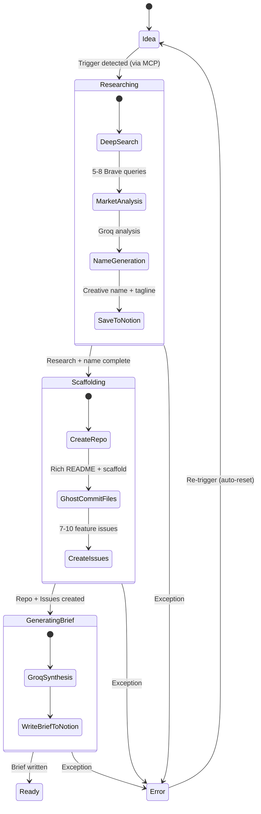
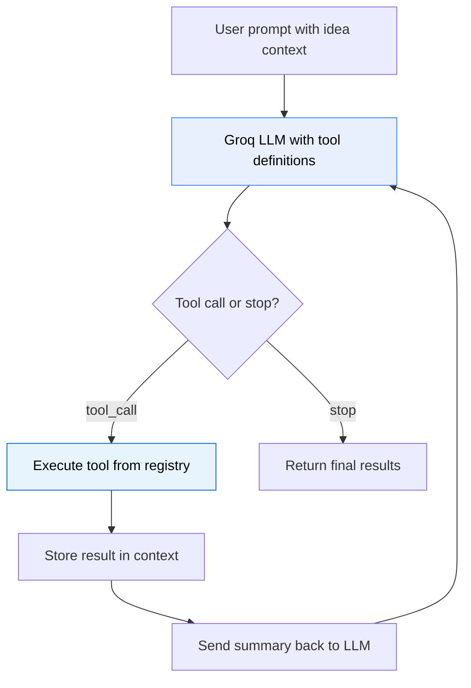
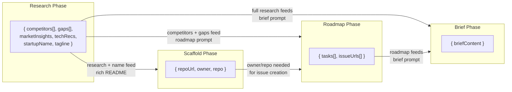
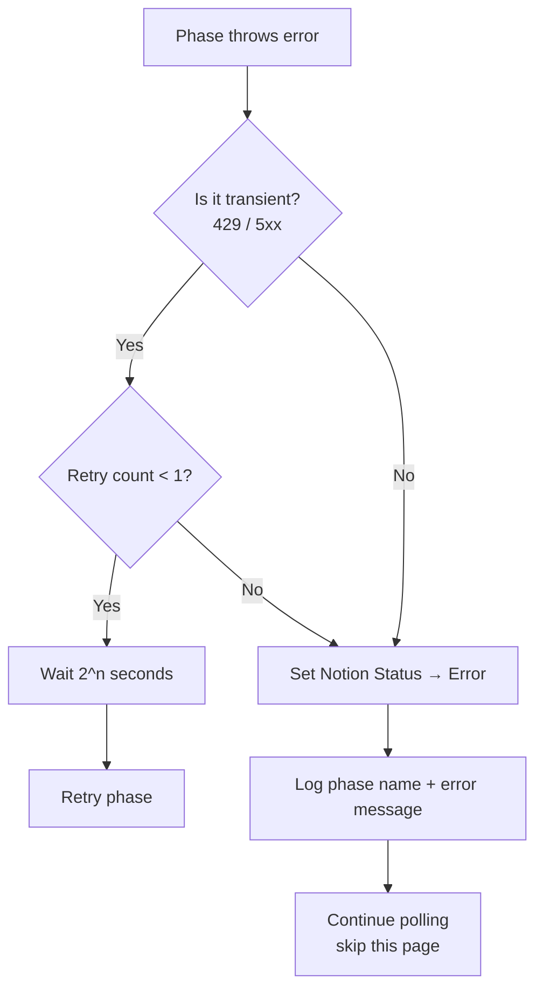

# Technical Design Document: ZeroToRepo MVP

> **48-Hour Hackathon Build** · Node.js · MCP + AI Agent · Notion → GitHub Pipeline

---

## 1. Executive Summary

| Field | Value |
| :--- | :--- |
| **System** | ZeroToRepo — LLM-Driven AI Agent with MCP Integration |
| **Runtime** | Node.js v20+ (local execution) |
| **Primary Goal** | Turn a Notion idea into a fully scaffolded GitHub repo in **< 2 minutes** |
| **Trigger** | Single checkbox click in Notion |
| **Output** | Private GitHub repo + labeled issues + deep competitor research + startup name + investor brief |
| **Key Innovation** | LLM agent decides tool execution order via Groq function calling; Notion ops via MCP protocol |
| **Build Window** | 48 hours (hackathon) |
| **Total API Cost** | $0 (all free tiers) |

---

## 2. System Architecture

### 2.1 High-Level Architecture Diagram



### 2.2 End-to-End Sequence Diagram



### 2.3 State Machine



### 2.4 LLM Agent Orchestration

Unlike a hardcoded pipeline, the **LLM agent decides** which tool to call next. The orchestration loop:



---

## 3. Tech Stack

| Layer | Technology | Rationale |
| :--- | :--- | :--- |
| **Runtime** | Node.js v20+ | Native async/await, excellent JSON handling, fast startup |
| **MCP** | `@modelcontextprotocol/sdk` + `@notionhq/notion-mcp-server` | Hackathon requirement; Notion ops via MCP protocol (stdio transport) |
| **AI Orchestration** | Groq + `llama-3.3-70b-versatile` (function calling) | LLM agent decides tool order; free tier = 100K TPD |
| **State/UI** | Notion API (via MCP) | Already used for planning; acts as dashboard with zero extra UI work |
| **Search** | Brave Search API | Developer-friendly JSON, 2K free queries/month, no SERP scraping needed |
| **Git** | Octokit (`@octokit/rest`) | Official GitHub SDK; Data API enables ghost commits (no `git clone`) |
| **CLI UX** | `@clack/prompts` | Beautiful terminal spinners/progress for live demo |
| **Config** | `dotenv` | Standard `.env` pattern for secrets |

---

## 4. Project Structure

```
zerotorepo/
├── src/
│   ├── index.js            # Entry point — polling loop + CLI + graceful shutdown
│   ├── agent.js            # 🤖 LLM agent — Groq function calling, 10 tools, context injection
│   ├── stateMachine.js     # Routes: live → agent, mock → sequential pipeline
│   ├── mcp-client.js       # MCP client — spawns Notion MCP server (stdio transport)
│   ├── mcp-server.js       # ZeroToRepo as MCP server (7 tools for AI assistants)
│   ├── notion.js           # Notion ops via MCP (query, patch, post, delete blocks)
│   ├── research.js         # Deep multi-query Brave search + Groq analysis + name gen
│   ├── scaffold.js         # GitHub repo creation + ghost commits + rich README
│   ├── roadmap.js          # Groq roadmap generation (feature-focused, no boilerplate)
│   ├── brief.js            # Investor brief synthesis
│   └── config.js           # Environment config validation
├── prompts/
│   ├── gap-analysis.txt    # System prompt for deep competitor analysis
│   ├── roadmap.txt         # System prompt for implementable task generation
│   ├── brief.txt           # System prompt for investor brief synthesis
│   └── name-generation.txt # System prompt for creative startup naming
├── scripts/
│   └── reset-db.js         # Reset Notion DB via MCP (status, trigger, sub-pages)
├── agent_docs/             # Tech stack docs, code patterns, testing guides
├── mcp.json                # MCP server config for Claude Desktop / VS Code
├── .env.example            # Template with all required keys
├── .gitignore
├── package.json
└── README.md
```

---

## 5. Component Design

### 5.1 `config.js` — Environment Validation

Validates all required environment variables at startup. Fails fast with clear messages.

```js
// Required environment variables
const REQUIRED = [
  'NOTION_API_KEY',       // Notion integration secret (ntn_*)
  'NOTION_DATABASE_ID',   // 32-char hex ID of the Ideas database
  'GROQ_API_KEY',         // Groq API key (gsk_*)
  'BRAVE_API_KEY',        // Brave Search API key
  'GITHUB_TOKEN',         // GitHub fine-grained PAT (Read & Write: Administration, Contents, Issues)
  'GITHUB_OWNER',         // GitHub username or org for new repos
];

// Exported config object
module.exports = {
  notion: { apiKey, databaseId },
  groq:   { apiKey, model: 'llama-3.3-70b-versatile' },
  brave:  { apiKey },
  github: { token, owner },
  polling: { intervalMs: 5000 },
};
```

---

### 5.2 `notion.js` — Notion Operations via MCP

All Notion operations go through the Notion MCP Server (`@notionhq/notion-mcp-server`) via stdio transport. The MCP client (`mcp-client.js`) spawns the server as a child process.

| Function | Signature | MCP Tool Used | Description |
| :--- | :--- | :--- | :--- |
| `pollForTrigger` | `() → Promise<Page \| null>` | `API-query-data-source` | Queries DB for pages with `Trigger == true` AND (`Status == Idea` OR `Status == Error`) |
| `updateStatus` | `(pageId, status) → Promise<void>` | `API-patch-page` | Sets the Status property |
| `writeSubPage` | `(parentId, title, markdown) → Promise<string>` | `API-post-page` | Creates a child page with rich-text blocks |
| `setGitHubUrl` | `(pageId, url) → Promise<void>` | `API-patch-page` | Sets the `GitHub URL` property |
| `resetTrigger` | `(pageId) → Promise<void>` | `API-patch-page` | Unchecks the `Trigger` checkbox |
| `subPageExists` | `(parentId, title) → Promise<boolean>` | `API-get-block-children` | Checks for idempotency |
| `disconnect` | `() → Promise<void>` | — | Gracefully closes MCP connection |

**Notion Database Schema (exact property names):**

| Property Name | Type | Values / Format |
| :--- | :--- | :--- |
| `Name` | `title` | Project name string |
| `Description` | `rich_text` | Optional idea context for deeper research |
| `Status` | `status` | `Idea` · `Researching` · `Scaffolding` · `Generating Brief` · `Ready` · `Error` |
| `Trigger` | `checkbox` | `true` / `false` |
| `GitHub URL` | `url` | `https://github.com/{owner}/{repo}` |

**Key MCP call — polling query:**

```js
const result = await mcpClient.callTool('API-query-data-source', {
  data_source_id: config.notion.databaseId,
  filter: {
    and: [
      { property: 'Trigger', checkbox: { equals: true } },
      { or: [
        { property: 'Status', status: { equals: 'Idea' } },
        { property: 'Status', status: { equals: 'Error' } },
      ]},
    ],
  },
  page_size: 1,
});
```

---

### 5.3 `research.js` — Deep Multi-Query Research + Name Generation

| Function | Signature | Description |
| :--- | :--- | :--- |
| `deepSearch` | `(name, desc) → Promise<SearchSet[]>` | Runs 5-8 targeted Brave searches with keyword extraction for long descriptions |
| `analyzeGaps` | `(name, desc, searchSets) → Promise<ResearchData>` | Sends all results to Groq for competitor/gap/market analysis |
| `generateStartupName` | `(name, desc, research) → Promise<NameData>` | Groq generates creative name + tagline from research context |
| `formatResearchMarkdown` | `(name, nameData, research) → string` | Formats rich markdown for Notion sub-page |

**Deep Search Strategy:**

```js
// Extract keywords from long descriptions to build short queries (<100 chars)
const queries = buildSearchQueries(projectName, description);
// Runs: "{name} competitors", "{name} market size", "{keywords} alternatives",
//        "{keywords} trends", "{name} pricing model", etc.
// Rate limited: 1 req/s, failed queries logged and skipped (resilient)
```

**Groq parameters (gap analysis):**

```json
{
  "model": "llama-3.3-70b-versatile",
  "temperature": 0.3,
  "max_tokens": 2500,
  "response_format": { "type": "json_object" }
}
```

**Expected Groq response shape:**

```json
{
  "competitors": [
    { "name": "PetCo", "url": "https://petco.com", "strengths": [...], "weaknesses": [...], "pricing": "$20-50/mo" }
  ],
  "gaps": [
    { "gap": "No organic pet food delivery", "severity": "high", "opportunity": "Subscription-based organic delivery" }
  ],
  "marketInsights": {
    "targetAudience": "Urban pet owners aged 25-45",
    "marketSize": "$5.2B growing at 12% YoY",
    "trends": ["Organic pet food", "Pet wellness tech", "Adoption-first retail"]
  },
  "techRecommendations": ["React Native for mobile app", "Shopify for e-commerce"],
  "summary": "The pet retail space in Islamabad..."
}
```

---

### 5.4 `scaffold.js` — GitHub Repo + Ghost Commits

| Function | Signature | Description |
| :--- | :--- | :--- |
| `createRepo` | `(name) → Promise<{repoUrl, owner, repo}>` | Creates a private repo via `POST /user/repos` |
| `ghostCommit` | `(owner, repo, files) → Promise<void>` | Writes multiple files to `main` without cloning (GitHub Data API) |
| `createIssues` | `(owner, repo, tasks) → Promise<string[]>` | Creates labeled issues from roadmap tasks; returns issue URLs |

**Ghost Commit Technique:**

Instead of `git clone → write → commit → push`, we use the GitHub Git Data API:

```
1. GET  /repos/{owner}/{repo}/git/ref/heads/main          → get current SHA
2. GET  /repos/{owner}/{repo}/git/commits/{sha}            → get tree SHA
3. POST /repos/{owner}/{repo}/git/blobs                    → create blob for each file
4. POST /repos/{owner}/{repo}/git/trees                    → create tree with all blobs
5. POST /repos/{owner}/{repo}/git/commits                  → create commit pointing to new tree
6. PATCH /repos/{owner}/{repo}/git/refs/heads/main         → update main to new commit
```

This commits **all files atomically in one commit** — much faster than individual `PUT /repos/{owner}/{repo}/contents/{path}` calls.

**Default scaffold files:**

| File | Content Source |
| :--- | :--- |
| `README.md` | Rich README with startup name, tagline, competitor table, gap analysis, tech recommendations |
| `package.json` | Generated with project name, version `0.1.0`, MIT license |
| `.gitignore` | Standard Node.js `.gitignore` |
| `src/index.js` | Placeholder: `// TODO: Start building {projectName}` |

**GitHub API endpoints used:**

| Endpoint | Method | Purpose |
| :--- | :--- | :--- |
| `/user/repos` | `POST` | Create private repository |
| `/repos/{owner}/{repo}/git/ref/heads/main` | `GET` | Get latest commit SHA |
| `/repos/{owner}/{repo}/git/commits/{sha}` | `GET` | Get tree SHA |
| `/repos/{owner}/{repo}/git/blobs` | `POST` | Create file blobs |
| `/repos/{owner}/{repo}/git/trees` | `POST` | Create tree with blobs |
| `/repos/{owner}/{repo}/git/commits` | `POST` | Create commit object |
| `/repos/{owner}/{repo}/git/refs/heads/main` | `PATCH` | Fast-forward main |
| `/repos/{owner}/{repo}/issues` | `POST` | Create issues |
| `/repos/{owner}/{repo}/labels` | `POST` | Create custom labels |

---

### 5.5 `roadmap.js` — Groq Roadmap + Issue Mapping

| Function | Signature | Description |
| :--- | :--- | :--- |
| `generateRoadmap` | `(name, desc, research) → Promise<{tasks: Task[]}>` | Prompts Groq for 7–10 implementable feature tasks (no boilerplate) |

**Groq parameters (roadmap):**

```json
{
  "model": "llama-3.3-70b-versatile",
  "temperature": 0.4,
  "max_tokens": 2000,
  "response_format": { "type": "json_object" }
}
```

**Key design decision:** The roadmap prompt explicitly excludes boilerplate tasks (e.g., "set up project", "create README") since those are already scaffolded. Only feature-level, implementable tasks are generated.

**Expected task schema:**

```json
{
  "tasks": [
    {
      "title": "Set up project boilerplate with Express",
      "description": "Initialize Node.js project with Express, configure ESLint, add health-check endpoint at /api/health.",
      "priority": "high",
      "label": "setup"
    }
  ]
}
```

**Label mapping for GitHub Issues:**

| Priority | GitHub Label | Color |
| :--- | :--- | :--- |
| `high` | `priority: high` | `#d73a4a` (red) |
| `medium` | `priority: medium` | `#fbca04` (yellow) |
| `low` | `priority: low` | `#0e8a16` (green) |

Additional labels applied from the `label` field: `setup`, `feature`, `research`, `infra`, `docs`.

---

### 5.6 `brief.js` — Investor Brief Synthesis

| Function | Signature | Description |
| :--- | :--- | :--- |
| `synthesizeBrief` | `(displayName, startupName, desc, research, roadmap) → Promise<{briefContent}>` | Combines research + roadmap into a compelling 1-page brief |

**Groq parameters (brief):**

```json
{
  "model": "llama-3.3-70b-versatile",
  "temperature": 0.6,
  "max_tokens": 2500
}
```

**Brief structure (output sections):**

1. **Problem** — What pain point does this solve?
2. **Market Gap** — What do competitors miss? (from research)
3. **Solution** — What will this project build?
4. **Roadmap** — Key milestones (from roadmap tasks)
5. **Why Now** — Market timing argument

---

### 5.7 `agent.js` — LLM Agent Orchestrator

The central innovation: instead of a hardcoded pipeline, an **LLM agent** decides which tool to call next using Groq's function calling API.

**Tool Registry (10 tools):**

| Tool | Phase | What It Does |
| :--- | :--- | :--- |
| `update_notion_status` | All | Update idea status in Notion via MCP |
| `deep_search` | Research | Run 5-8 Brave searches |
| `analyze_market` | Research | Groq competitor/gap/market analysis |
| `generate_startup_name` | Research | Creative name + tagline from research |
| `save_research_to_notion` | Research | Save rich research report via MCP |
| `create_github_repo` | Scaffold | Create repo + ghost commit scaffold |
| `set_github_url` | Scaffold | Set GitHub URL on Notion page via MCP |
| `create_roadmap_issues` | Roadmap | Generate & create 7-10 GitHub Issues |
| `write_investor_brief` | Brief | Synthesize brief → Notion via MCP |
| `finalize_idea` | Done | Mark Ready, uncheck trigger |

**Context Injection:** Large payloads (search results, research data, startup name) are stored in a shared context object and automatically injected into tool arguments — the LLM only sees compact summaries.

**Token Optimization:**
- Message history trimmed to last 10 messages per iteration
- Tool results always summarized (no raw payloads sent to LLM)
- Agent max_tokens: 1024 (only needs short tool-call decisions)
- Temperature: 0 (deterministic tool selection)

```js
async function runAgent(ideaName, description, notionPageId, options) {
  const tools = buildToolsForLLM();
  const context = {}; // Shared state between tool calls

  while (iterations < MAX_ITERATIONS) {
    // Trim history to control token usage
    const trimmed = trimMessages(messages, 10);

    const completion = await groq.chat.completions.create({
      model: 'llama-3.3-70b-versatile',
      temperature: 0,
      max_tokens: 1024,
      tools,
      tool_choice: 'auto',
      messages: trimmed,
    });

    // If LLM says stop, we're done
    if (choice.finish_reason === 'stop') break;

    // Execute each tool call, inject context, store results
    for (const toolCall of assistantMessage.tool_calls) {
      const result = await TOOL_REGISTRY[toolCall.function.name].fn(args);
      // Store in context for future tools
      // Send compact summary back to LLM
    }
  }
}
```

### 5.8 `stateMachine.js` — Mode Router

Routes between two modes:
- **Live mode:** Delegates to `agent.js` — LLM-driven orchestration
- **Mock mode:** Sequential pipeline with hardcoded fake data (no API calls)

### 5.9 `mcp-client.js` — MCP Client

Spawns the Notion MCP server as a child process and communicates via stdio:

```js
const transport = new StdioClientTransport({
  command: 'node',
  args: [require.resolve('@notionhq/notion-mcp-server/bin/cli.mjs')],
  env: { NOTION_TOKEN: config.notion.apiKey },
});
const client = new Client({ name: 'zerotorepo', version: '1.0.0' });
await client.connect(transport);
```

### 5.10 `mcp-server.js` — ZeroToRepo as MCP Server

Exposes 7 high-level tools so any MCP-compatible AI assistant can drive the pipeline:

| Tool | Description |
| :--- | :--- |
| `process_idea` | Run the full pipeline for a given idea |
| `research_competitors` | Deep research only |
| `generate_name` | Generate startup name from research |
| `scaffold_repo` | Create GitHub repo with scaffold |
| `generate_roadmap` | Generate and create roadmap issues |
| `generate_brief` | Synthesize investor brief |
| `list_notion_ideas` | List all ideas in the Notion database |

---

## 6. Data Flow Between Phases



**Context injection in agent.js** handles this data flow automatically — large objects are stored in a shared `context` object and injected into tool arguments without the LLM needing to pass them.

### Phase Output Contracts

| Phase | Output Type | Shape |
| :--- | :--- | :--- |
| **Research** | `ResearchResult` | `{ competitors: Array<{name, url, strengths[], weaknesses[], pricing}>, gaps: Array<{gap, severity, opportunity}>, marketInsights: {targetAudience, marketSize, trends[]}, techRecommendations: string[], summary: string }` |
| **Name Gen** | `NameResult` | `{ name: string, tagline: string, reasoning: string }` |
| **Scaffold** | `ScaffoldResult` | `{ repoUrl: string, owner: string, repo: string }` |
| **Roadmap** | `RoadmapResult` | `{ tasks: Array<{title, description, priority, label}>, issueUrls: string[] }` |
| **Brief** | `BriefResult` | `{ briefContent: string }` |

---

## 7. Error Handling Strategy

### 7.1 Per-Phase Try/Catch

Every phase is wrapped in a `runPhase` helper:

```js
async function runPhase(phaseName, fn) {
  const MAX_RETRIES = 1;
  for (let attempt = 0; attempt <= MAX_RETRIES; attempt++) {
    try {
      return await fn();
    } catch (err) {
      const isTransient = err.status === 429 || (err.status >= 500 && err.status < 600);
      if (isTransient && attempt < MAX_RETRIES) {
        const delay = Math.pow(2, attempt + 1) * 1000; // 2s, 4s...
        console.warn(`[${phaseName}] Transient error (${err.status}), retrying in ${delay}ms...`);
        await sleep(delay);
        continue;
      }
      throw new PhaseError(phaseName, err);
    }
  }
}
```

### 7.2 Error Recovery



### 7.3 Idempotency Checks

Each phase checks for prior completion before executing:

| Phase | Idempotency Check |
| :--- | :--- |
| **Research** | Skip if a sub-page titled "Research — {name}" already exists |
| **Scaffold** | Skip if `GitHub URL` property is already populated |
| **Roadmap** | Skip if repo already has ≥ 5 open issues |
| **Brief** | Skip if a sub-page titled "Brief — {name}" already exists |

This allows safe re-runs if the process crashes mid-pipeline.

---

## 8. Implementation Timeline (48-Hour Hackathon)

### Hour 0–6: Foundation

| Task | Hours | Deliverable |
| :--- | :--- | :--- |
| Project init (`npm init`, install deps) | 0–1 | `package.json` with all dependencies |
| Write `config.js` with env validation | 1–2 | Fail-fast startup with clear error messages |
| Write `notion.js` — poll + status update | 2–4 | Polling loop detects trigger within 5 seconds |
| Wire up `index.js` with `@clack/prompts` | 4–6 | CLI shows live status: `◼ Polling… ◼ Found: ProjectX` |

### Hour 6–18: Core Pipeline

| Task | Hours | Deliverable |
| :--- | :--- | :--- |
| Write `research.js` — Brave + Groq | 6–9 | Gap analysis written as Notion sub-page |
| Write `scaffold.js` — repo + ghost commit | 9–13 | Private repo appears on GitHub with scaffold files |
| Write `roadmap.js` — Groq JSON → issues | 13–16 | 7–10 labeled issues created on GitHub |
| Write `brief.js` — investor brief | 16–18 | Brief sub-page created in Notion |

### Hour 18–30: Integration & State Machine

| Task | Hours | Deliverable |
| :--- | :--- | :--- |
| Write `stateMachine.js` — full orchestration | 18–22 | End-to-end flow: Idea → Ready |
| Error handling + retry logic | 22–26 | Graceful failures with Notion "Error" status |
| Idempotency checks | 26–28 | Safe re-runs after crash |
| Mock mode (`--mock` flag) | 28–30 | Full demo without burning API quota |

### Hour 30–42: Polish & Testing

| Task | Hours | Deliverable |
| :--- | :--- | :--- |
| End-to-end smoke testing | 30–34 | 3 different ideas processed successfully |
| CLI UX polish (spinners, colors, timing) | 34–38 | Demo-ready terminal output |
| Prompt engineering refinement | 38–40 | Higher quality research/roadmap/brief output |
| Edge cases (long names, special chars) | 40–42 | Robust input handling |

### Hour 42–48: Demo Prep

| Task | Hours | Deliverable |
| :--- | :--- | :--- |
| Write `README.md` with setup instructions | 42–44 | Judges can clone and run in < 2 minutes |
| Record backup demo video | 44–46 | Insurance against live demo failures |
| Rehearse live demo flow | 46–48 | Smooth 3-minute presentation |

---

## 9. MCP Integration (Core Architecture)

MCP (Model Context Protocol) is a **core runtime component**, not just a development aid. ZeroToRepo uses MCP in two ways:

### 9.1 As MCP Client — Consuming Notion MCP Server

All Notion API operations go through the official `@notionhq/notion-mcp-server` (v2.2.1), spawned as a child process via stdio transport.

| MCP Tool Used | Purpose | Called By |
| :--- | :--- | :--- |
| `API-query-data-source` | Poll for triggered ideas | `notion.pollForTrigger()` |
| `API-patch-page` | Update status, set URL, reset trigger | `notion.updateStatus()`, `notion.setGitHubUrl()`, `notion.resetTrigger()` |
| `API-post-page` | Create research/brief sub-pages | `notion.writeSubPage()` |
| `API-get-block-children` | Check if sub-page exists (idempotency) | `notion.subPageExists()` |
| `API-delete-a-block` | Delete sub-pages during reset | `scripts/reset-db.js` |

**Why MCP instead of direct SDK?**
- Hackathon requirement: MCP is mandatory
- Decouples from Notion SDK version changes (v5 had breaking changes)
- Same protocol used by AI assistants — consistent interface

### 9.2 As MCP Server — Exposing ZeroToRepo Tools

`src/mcp-server.js` exposes 7 tools so any MCP-compatible AI assistant (Claude Desktop, VS Code Copilot, etc.) can drive the pipeline:

```bash
# Run as MCP server
node src/mcp-server.js

# Or configure in mcp.json for auto-discovery
```

| Tool | Input | Output |
| :--- | :--- | :--- |
| `process_idea` | `{ idea_name, description }` | Full pipeline result |
| `research_competitors` | `{ idea_name, description }` | Research data |
| `generate_name` | `{ idea_name, description, research }` | Name + tagline |
| `scaffold_repo` | `{ project_name, description, research }` | Repo URL |
| `generate_roadmap` | `{ project_name, description, research, owner, repo }` | Task list + issue URLs |
| `generate_brief` | `{ project_name, startup_name, description, research, roadmap }` | Brief content |
| `list_notion_ideas` | `{}` | List of ideas from Notion DB |

### 9.3 MCP During Development

MCP servers were also used during development for rapid API exploration:

| MCP Server | Development Usage |
| :--- | :--- |
| **Notion MCP** | Validated database schema, tested property names, debugged filter syntax |
| **GitHub MCP** | Validated PAT permissions, tested ghost commit flow, verified issue creation |

### 9.4 Why This Architecture Matters

```
Traditional pipeline:
  Hardcoded sequence → Direct SDK calls → Tightly coupled

ZeroToRepo architecture:
  LLM Agent (decides order) → MCP Protocol (Notion) + Direct APIs (GitHub/Brave/Groq)
  + ZeroToRepo itself exposed as MCP server for AI assistants to consume
```

This means:
1. The pipeline order is **AI-determined**, not hardcoded
2. Notion operations are **protocol-based** (MCP), not SDK-coupled
3. External AI assistants can **drive the pipeline** via MCP tools
4. The system demonstrates **both MCP client and MCP server** patterns

---

## 10. API Contract Details

### 10.1 Groq API

| Parameter | Agent Orchestration | Gap Analysis | Name Gen | Roadmap | Brief |
| :--- | :--- | :--- | :--- | :--- | :--- |
| **Model** | `llama-3.3-70b-versatile` | same | same | same | same |
| **Temperature** | `0` (deterministic) | `0.3` (factual) | `0.8` (creative) | `0.4` (structured) | `0.6` (creative) |
| **Max Tokens** | `1024` | `2500` | `500` | `2000` | `2500` |
| **Response Format** | — (function calling) | `json_object` | `json_object` | `json_object` | free-text markdown |
| **Function Calling** | ✅ 10 tools | — | — | — | — |

**Rate limits (free tier):** 30 requests/min, 100,000 tokens/day.
**Token optimization:** Message history trimmed, tool results summarized, ~14 Groq calls per pipeline run.

### 10.2 Brave Search API

| Parameter | Value |
| :--- | :--- |
| **Endpoint** | `GET https://api.search.brave.com/res/v1/web/search` |
| **Auth Header** | `X-Subscription-Token: {BRAVE_API_KEY}` |
| **Query Params** | `q={query}&count=10&safesearch=moderate` |
| **Rate Limit** | 1 request/second, 2,000 queries/month (free) |

### 10.3 Notion API (via MCP)

| Parameter | Value |
| :--- | :--- |
| **Transport** | MCP stdio (spawns `@notionhq/notion-mcp-server` as child process) |
| **Auth** | `NOTION_TOKEN` env var passed to MCP server |
| **MCP Tools Used** | `API-query-data-source`, `API-patch-page`, `API-post-page`, `API-get-block-children`, `API-delete-a-block` |
| **Rate Limit** | 3 requests/second (average) |

### 10.4 GitHub API (Octokit)

| Parameter | Value |
| :--- | :--- |
| **Base URL** | `https://api.github.com` |
| **Auth** | `token` auth via Octokit constructor |
| **Required Permissions** | Fine-grained PAT: Read & Write on Administration, Contents, Issues |
| **Rate Limit** | 5,000 requests/hour (authenticated) |

---

## 11. Testing Strategy

### 11.1 Manual Smoke Test Checklist

Run these tests before the demo to verify end-to-end functionality:

| # | Test | Expected Result | ✅ |
| :--- | :--- | :--- | :--- |
| 1 | Start script with valid `.env` | CLI shows "Polling…" with spinner | ☐ |
| 2 | Start script with missing env var | Fails immediately with clear message | ☐ |
| 3 | Check "Trigger" on a new idea | Status cycles: Researching → Scaffolding → Generating Brief → Ready | ☐ |
| 4 | Check GitHub after run | Repo exists with README, package.json, .gitignore, src/index.js | ☐ |
| 5 | Check GitHub Issues | 7–10 issues with `priority: high/medium/low` labels | ☐ |
| 6 | Check Notion sub-pages | "Research" and "Brief" sub-pages exist with real content | ☐ |
| 7 | Check Notion row | `GitHub URL` is populated, `Status` = Ready, `Trigger` unchecked | ☐ |
| 8 | Re-trigger same idea | Idempotency: skips already-completed phases | ☐ |
| 9 | Simulate API error | Status set to "Error", error logged, other ideas unaffected | ☐ |
| 10 | Run 3 different ideas sequentially | All 3 succeed with unique repos and content | ☐ |

### 11.2 Mock Mode (`--mock` flag)

For demos without Wi-Fi or to preserve API quota:

```bash
node src/index.js --mock
```

**Behavior:**
- Skips all external API calls (Brave, Groq, GitHub, Notion)
- Uses hardcoded realistic responses from `fixtures/` folder
- Simulates timing delays (2s per phase) for demo realism
- Prints the same CLI output as production mode
- Useful for rehearsal and offline judging sessions

### 11.3 Notion DB Reset Script

```bash
node scripts/reset-db.js
```

**Behavior:**
- Queries all pages in the database
- Sets `Status` → `Idea`, `Trigger` → `false`, `GitHub URL` → empty
- Deletes all sub-pages (Research, Brief)
- Used between demo runs to return to a clean state

---

## 12. Cost Breakdown

| Service | Tier | Limit | Cost | Notes |
| :--- | :--- | :--- | :--- | :--- |
| **Groq API** | Free | 100K tokens/day, 30 RPM | **$0** | ~14 calls per run, ~20K tokens; ~5 runs/day |
| **Brave Search** | Free | 2,000 queries/month | **$0** | 5-8 queries per run |
| **Notion API** (via MCP) | Free (integration) | 3 req/s avg | **$0** | ~10 calls per run |
| **GitHub API** | Free (PAT) | 5,000 req/hour | **$0** | ~15 calls per run |
| **Node.js** | — | — | **$0** | Local execution |
| | | | **Total: $0** | |

---

## 13. Security & Secrets

| Secret | Storage | Scope |
| :--- | :--- | :--- |
| `NOTION_API_KEY` | `.env` (gitignored) | Single integration, single database |
| `GROQ_API_KEY` | `.env` (gitignored) | Personal free-tier key |
| `BRAVE_API_KEY` | `.env` (gitignored) | Personal free-tier key |
| `GITHUB_TOKEN` | `.env` (gitignored) | Fine-grained PAT: Administration, Contents, Issues (Read & Write) |

**`.env.example`** ships with placeholder values so new contributors know what to configure:

```env
NOTION_API_KEY=ntn_your_integration_secret_here
NOTION_DATABASE_ID=your_32_char_hex_database_id_here
GROQ_API_KEY=gsk_your_groq_api_key_here
BRAVE_API_KEY=your_brave_search_api_key_here
GITHUB_TOKEN=ghp_your_github_pat_here
GITHUB_OWNER=your_github_username
```

---

## 14. Success Criteria

| Metric | Target | How to Measure |
| :--- | :--- | :--- |
| **Time to Repo** | < 60 seconds | Stopwatch from checkbox click to GitHub URL appearing in Notion |
| **Roadmap Depth** | ≥ 7 issues | Count of issues created in the new repo |
| **Research Quality** | ≥ 3 specific gaps | Manual review — gaps must reference real competitors |
| **Brief Quality** | Project-specific insights | Manual review — no generic LLM filler |
| **Zero Config** | 0 manual git commands | User only clicks a checkbox |
| **Error Recovery** | Graceful | Errors show in Notion, don't crash the process |
| **Demo Reliability** | 3/3 successful runs | Three consecutive ideas processed without failure |

---

## 15. Dependencies (`package.json`)

```json
{
  "name": "zerotorepo",
  "version": "1.0.0",
  "description": "AI agent that turns Notion ideas into GitHub repos via MCP",
  "main": "src/index.js",
  "scripts": {
    "start": "node src/index.js",
    "mock": "node src/index.js --mock",
    "reset": "node scripts/reset-db.js",
    "mcp": "node src/mcp-server.js"
  },
  "dependencies": {
    "@modelcontextprotocol/sdk": "^1.28.0",
    "@notionhq/notion-mcp-server": "^2.2.1",
    "@octokit/rest": "^22.0.0",
    "groq-sdk": "^0.18.0",
    "dotenv": "^17.3.0",
    "@clack/prompts": "^0.10.0"
  }
}
```

---

*Document Owner: Hackathon Team · Built for the 48-Hour Sprint · Last Updated: 2026-03-26*
